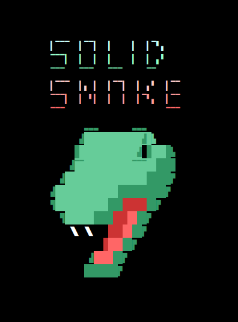
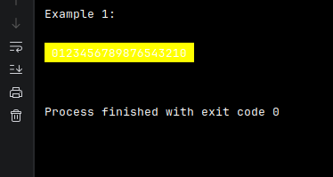
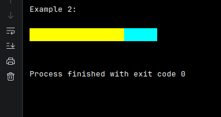
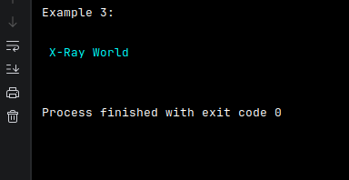

<h1 align="center">
$\Huge \substack{ 
\color{#FF5500}{\textsf{Java}} \\ 
\color{#555555}{\pmb{\texttt{Illustration with}}} \\ 
\color{#555555}{\texttt{System.out.println();}} 
}$
</h1>

  

<h2 align="center">Steps</h2>

  Inside <code>System.out.println()</code>, first goes the code 1, then, your text, then, the code 2.

<em>• code 1 (first):</em> <code>"\033[48;2;" + 0 + ";" + 0 + ";" + 0 + "m"</code>

<em>• code 2 (last):</em> <code>"\033[0m"</code>

<strong><code>System.out.println(     "\033[48;2;"+0+";"+0+";"+0+"m"     +" YOUR TEXT "+     "\033[0m"     );</code></strong>

This prints one line of the graphic. As you see, you just need to modify the numbers <code>0</code> inside <code>+0+";"+0+";"+0+"</code>, which stand as RGB colors, the first <code>0</code> is for red colors, the next <code>0</code> is for green, and the third <code>0</code> is for blue.

  <em>the "code 1" is which generates the color fill, the "code 2" is just a closure code, because without it, the fill will take all the width of the console. When you paint two or more colors, you only need to put this closure code once, at the end, due to the overwrite property of the "code 1" that paints above the last color. </em>

<h2 align="center">Example</h2>

  

The code is <code>System.out.println("\033[48;2;" + 255 + ";" + 255 + ";" + 0 + "m" + " 0123456789876543210 " + "\033[0m");</code>, this prints a large rectangle because is based in the quantity of characters inside.

For painting two colors, just put the "code 1" with a particular color, then, characters that shape its width, then, the "code 1" again with another color, then, another quantity of characters, and finally, the "code 2".

  

<code>System.out.println("\033[48;2;" + 255 + ";" + 255 + ";" + 0 + "m" + "                    " + "\033[48;2;" + 0 + ";" + 255 + ";" + 255 + "m" + "       " + "\033[0m");</code>.

<h2 align="center">Extra</h2>

If you want to add color to the text itself instead of its background, replace the <code>48</code> in our "code 1" for <code>38</code>:

<em>• new code 1:</em> <code>"\033[38;2;" + 0 + ";" + 0 + ";" + 0 + "m"</code>

In practice, you will notice the closure code finishes both, the background fill and the text color.

  

<code>System.out.println("\033[38;2;" + 0 + ";" + 255 + ";" + 255 + "m" + " X-Ray World  " + "\033[0m");</code>

<h2 align="center"></h2>
<h1 align="center">www.x-ray.world</h1>
